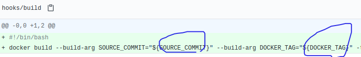

これまでに、リリースしたアプリのバージョンを管理するために、gitの情報をアプリケーション内に埋め込む方法を紹介してきた。

1. gradle + git-tag + spring + github actions: https://github.com/growingspaghetti/temp-github-actions-release-spring
2. gradle + git-tag + picocli: https://github.com/growingspaghetti/temp-java-picocli-shadow-graalvm/tree/pure-java
3. go + -ldflags@コンパイル + std.flag: https://github.com/growingspaghetti/temp-go-flag-cli

最後に今回は、アプリケーション内部にgitの情報を埋め込むのではなく、Dockerコンテナ化というパッケージ化技術を使って、gitの情報をコンテナに書き込む。アプリはこれを参照する。

1. Dockerをインストール
2. Docker拡張機能をVSCodeにインストール
3. hub.docker.comのアカウントを作成
4. Dockerレポジトリを作成
5. Github連帯
6. 自動ビルド設定
7. パッケージ化設定ファイルの作成と、git情報についての指示
8. 確認

# 1. Dockerをインストール

https://docs.docker.jp/docker-for-windows/install.html

WindowsではインストーラーDocker Desktop Installer.exeが提供されているので、よしなにやってくれるだろう。

# 2. Docker拡張機能をVSCodeにインストール

https://marketplace.visualstudio.com/items?itemName=ms-azuretools.vscode-docker

VSCodeがよしなにやってくれる。

今回、このプラグインを使うのは最後の確認時の話のときのみだが、業務で運用する際はこれがあると何かと便利。

# 3. hub.docker.comのアカウントを作成

https://hub.docker.com でアカウントを作成する。

# 4. Dockerレポジトリを作成


これからこのリンクを参照

- Docker Hubの自作イメージを自動アップデートしてリリースする - Docker Hub https://qiita.com/KeisukeKudo/items/22eabb259e0c5f68c925#docker-hub

まあ、githubのレポジトリのDockerパッケージ版だと思えばいい。アプリケーションの単位が、アプリケーションバイナリから、その梱包物である、コンテナ単位になる。

# 5. Github連帯


ソースコードを管理しているgithubと連帯すると、ソースコードやタグがpushされた時に、ソースコードに対してDockerパッケージ化が自動で行われるようになる。

# 6. 自動ビルド設定


ソースコードの取得元を設定し、


`/^v([0-9.]+)$/`と`{\1}`で、gitで配布バージョンが作成された時に自動ビルドを行う。

# 7. パッケージ化設定ファイルの作成と、git情報についての指示

diffはこのコミットにある: https://github.com/growingspaghetti/temp-dockerhub-spring-version-git/commit/ddf565574966eed68d16bf453f88dbc565101ef4

パッケージ化は`Dockerfile`という設定ファイルに基づいて行われる。

コメントを入れておいたが、Dockerfileとかいうのが何を言っているのかわからないと思う。ミニリナックスを作っているのだと思ってもらえればいい。

ひとつ目のミニリナックスを使って、Gradle必要なSpringのライブラリをダウンロードしておき、それをふたつ目のミニリナックスに引き継ぎ、Springをコンパイル。それをみっつ目のミニリナックスが引き継いで、最終的にこの最後のミニリナックスが出来上がりのものとなる。最後のミニリナックスだけが破棄されずに残る。

上の「Docker Hubの自作イメージを自動アップデートしてリリースする」のページをみてもらればいいが、流れとしては、

1. DockerhubがGitの情報を自動ビルドに渡す。<br>
   
2. Dockerfileがその情報をコンテナ内に保存する。<br>
   
3. Springが起動時に、application.propertiesの値をその情報で置換する。<br>
   
4. VersionControllerが値を表示する。

# 8. 確認


Githubにタグ、ここでは`v0.1.0`をつけてpushすると、Dockerhubで自動ビルドが開始される。

上のDockerhub上で表示されている、この`0.1.0`はそのGitのタグから抽出されたもので、この`ddf5655`はGitのコミットからとられている。

なお、Githubでは次の写真のように表示される。


作成されたDockerコンテナはDockerhub上で配布されており、次のコマンドでダウンロードし、実行できる。


```shell
docker run -t -p 8080:8080 --rm ryojikodakari/temp-spring-git-tag-20210725:0.1.0
```

`-t`はLinux仮想ターミナルを意味し、`-p`はネットワークポート、`--rm`は終了時データ破棄のことである。

かくして、実のところ、ファイル名に相当するコンテナ名、`ryojikodakari/temp-spring-git-tag-20210725:0.1.0`にバージョン情報***0.1.0が含まれている***いるため、Dockerを使えばバージョン管理は必然的になされることになる。


なお、この`DIGEST`値はコンテナのハッシュ値で、Gitのコミットの値ではない。


サーバーの運用者はVSCodeのプラグインを使えば、`/version`にアクセスせずとも確認できる。

Dockerはクラウドネイティブとかいう話の中心となる技術である。
